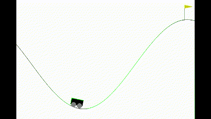

# RLib

The library that I built while learning some Reinforcement Learning algorithms. The library is built on top of the `Gymnasium` and `PyTorch` frameworks. It is designed to be as modular as possible. The documentation, built using `Sphinx` can be found [here](https://axeldinh.github.io/rlib/).

## Installation

### Code

To install the package simply run the following command:

```bash
pip install .
```

Remember that, if using a virtual environment, you must activate it before running the command. Furthermore,
if using ``conda``, you must call ``conda install pip`` before installing the package. Otherwise, the package will
be installed using another ``pip`` that is not the one from the ``conda`` environment. To run the library on all `gymnasium` environments, other dependencies are required. To install them, run the following command:

```bash
pip install gymnasium[all]
```

or

```bash
pip install "gymnasium[all]"
```

Note that installing `Box2D` and `MuJoCo` is not trivial and the installation is quite dependent on the OS. For example, to install `MuJoCo` on Windows, we add to install `MuJoCo` version `1.50.1` while the latest version when we write those lines is `2.1.0`.

### Documentation

To generate the documentation, one must install `Sphinx` and the `Furo` theme:

```bash
pip install sphinx
pip install furo
```

Then, to generate the documentation, run the following command:

```bash
cd docs
make html
```

The documentation will be generated in the ``docs/build/html`` folder. To open it, simply open the ``index.html`` in your browser.

### Examples

Here are a few examples of trained agents using the library:

| Q-Learning on Mountain Car | Deep QLearning on Lunar Lander | Evolution Strategy on Flappy Bird | Deep Deterministic Policy Gradient on Half Cheetah | PPO on Bipedal Walker |
|:--------------------------:|:--------------------------:|:--------------------------------:|:-------------------------------------------------:|:---------------------:|
|  |  |  |  |  |
