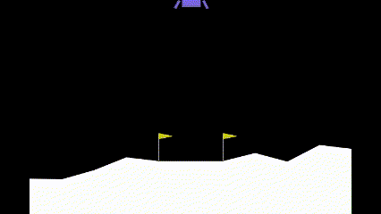

Introduction
============

Package Installation
--------------------

To install the package, run the following commands:

.. code-block:: bash

    git clone https://github.com/axeldinh/rlib.git
    cd rlib
    pip install -e .

To perform the tests, run the following commands:

.. code-block:: bash
    
    pip install pytest
    cd rlib
    pytest

However, tests are automatically performed on push using Github Actions.

Documentation Generation
------------------------

To generate the documentation, run the following commands:

.. code-block:: bash

    cd docs
    make html

Note that the documentation is generated using Sphinx. The documentation can be found in the ``docs/build/html`` directory.

Usage
------------

The package can then be simply imported using:

.. code-block:: python

    import rlib

The code can be decomposed into two main parts `Learning` and `Agents`.

`Learning` contains the different algorithms which have been implemented while `Agents` contains the different agents which can be used to interact with the environment.

To use them on a `gymnasium` environment, the user most choose an algorithm along with the different parameters the agents should take.

For example, to use the `DeepQLearning` algorithm on the `gymnasium` `CartPole-v1` environment, as the action space is discrete, the agent should be a MLP. This can be done using the following code:

.. code-block:: python

    from rlib.learning import EvolutionStrategy

    env_kwargs = {'id': 'CartPole-v1'}
    agent_kwargs = {'hidden_sizes': [64, 64]}
    
    model = EvolutionStrategy(env_kwargs=env_kwargs, agent_kwargs=agent_kwargs, save_folder="EvStrat_CartPole-v1")

Note that only `dictionaries` are passed to the algorithms and agents. This is to allow the user to pass any parameters to the environment and the agent, while allowing a full saving of the model.
Finally, the model can be trained using the following code:

.. code-block:: python

    model.train()

And the plots and videos generated by the model can be saved using:

.. code-block:: python

    model.save_plots()
    model.save_videos()

Examples
------------

Here is a showcase of the algorithms used on different environments:

**Q-Learning on `MountainCar-v0`**:

.. image:: assets/qlearning_iter100000.gif
    :width: 400

**Deep Q-Learning on `LunarLander-v2`**:

**Evolution Strategy on `FlappyBird-v0`**:

.. image:: assets/evolution_strat_iter200.gif
    :width: 400

**Deep Deterministic Policy Gradient on `HalfCheetah-v4`**:

.. image:: assets/ddpg_iter4000.gif
    :width: 400

**Proximal Policy Optimization on `BipedalWalker-v3`**:

.. image:: assets/ppo_iter400.gif
    :width: 400